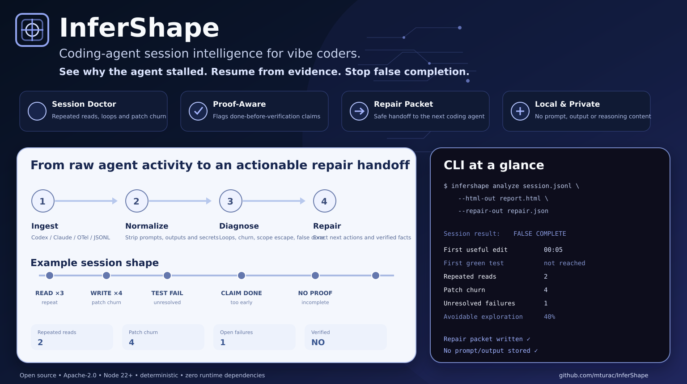

# InferShape

<p align="center">
  
</p>

[](https://github.com/mturac/InferShape/actions/workflows/ci.yml)
[](LICENSE)
[](package.json)

**InferShape explains why a coding-agent session stalled, churned, escaped scope, or claimed completion without proof — then emits a privacy-safe repair packet for the next agent.**

It is built for vibe coders using tools such as Codex, Claude Code, Cursor, OpenHands, and custom coding agents. InferShape is not another generic LLM dashboard. It focuses on the shape of software-delivery work:

- repeated repository reads and searches;
- patch churn and reverted edits;
- identical tool loops;
- failed commands that never recovered;
- full-suite thrashing instead of focused tests;
- writes outside declared scope;
- completion claims made before post-change verification;
- avoidable context and exploration waste.

InferShape runs locally, makes zero network calls, and removes prompt, completion, message, reasoning, tool-argument, tool-result, request-body, and response-body content during normalization.

## Quick start

Requirements: Node.js 22 or newer.

```bash
git clone https://github.com/mturac/InferShape.git
cd InferShape
npm ci
npm run build
```

Analyze a JSONL session and produce all artifacts:

```bash
node bin/infershape.mjs analyze examples/problem-session.jsonl \
  --json-out reports/session.json \
  --markdown-out reports/session.md \
  --html-out reports/session.html \
  --repair-out reports/repair.json \
  --fail-on-false-completion
```

Example summary:

```text
Session result              FALSE COMPLETE
Time to first edit          5.0 s
Time to first green test    not reached
Repeated reads              2
Patch churn                 3
Unresolved failures         1
Full-suite runs             3
Writes outside scope        1
Avoidable exploration       40%
```

Open `reports/session.html` for a local visual report. Feed `reports/repair.json` to the next agent as a bounded handoff instead of restarting discovery from zero.

## CLI

```text
infershape analyze <session.jsonl|json|-> [options]
infershape inspect <report.json> [--json]
infershape compare <baseline.json> <candidate.json> [--json] [--fail-on-regression]
infershape --version
infershape --help
```

### Analyze options

```text
--source <auto|generic|opentelemetry|openinference>
--repo <path>
--include-command-text
--json-out <path>
--markdown-out <path>
--html-out <path>
--repair-out <path>
--fail-on-false-completion
--fail-on-open-failures
```

Machine-readable report JSON goes to stdout. Operational errors go to stderr as typed JSON. Requested quality-gate failures exit with code `2`; invalid input and operational failures exit with code `1`.

Plans can be piped through stdin:

```bash
cat session.jsonl | infershape analyze - --repair-out repair.json
```

## Generic event format

InferShape accepts JSON arrays, an object containing `events`, `spans`, `records`, or `data`, and newline-delimited JSON.

A minimal normalized session looks like this:

```json
{"timestamp":"2026-08-28T09:00:00Z","type":"session_start","session_id":"run-42","objective":"Fix retry handling","scope_paths":["src/retry","test/retry"]}
{"timestamp":"2026-08-28T09:00:02Z","type":"file_read","session_id":"run-42","path":"src/retry/index.ts"}
{"timestamp":"2026-08-28T09:00:05Z","type":"file_write","session_id":"run-42","path":"src/retry/index.ts","content_hash":"sha256:..."}
{"timestamp":"2026-08-28T09:00:08Z","type":"test_run","session_id":"run-42","command":"npm test -- retry.test.ts","outcome":"success","test_scope":"focused"}
{"timestamp":"2026-08-28T09:00:10Z","type":"completion_claim","session_id":"run-42","claim":"done"}
```

The canonical schema is [`schema/session-event.schema.json`](schema/session-event.schema.json). The normalizer also recognizes common OpenTelemetry/OpenInference-shaped fields such as span names, attributes, nanosecond timestamps, tool names, paths, exit codes, and durations.

## Findings

| Code | Meaning |
|---|---|
| `IS101_REPEATED_EXPLORATION` | Files were repeatedly read after they had already been inspected |
| `IS102_PATCH_CHURN` | Files were rewritten repeatedly or returned to an earlier content hash |
| `IS103_TOOL_LOOP` | The same read, search, command, or tool signature repeated at least three times consecutively |
| `IS104_UNRESOLVED_FAILURE` | A failed command, test, tool result, or verification never recovered |
| `IS105_FULL_SUITE_THRASHING` | Broad test suites were retried without a focused test |
| `IS106_SCOPE_ESCAPE` | A write targeted a path outside declared scope |
| `IS107_FALSE_COMPLETION` | Completion was claimed while failures remained or before post-write verification |
| `IS108_CHANGED_WITHOUT_GREEN_TEST` | Changed files were observed without a passing test event |
| `IS109_CONTEXT_WASTE` | Repeated read/search activity exceeded the context-waste threshold |

The rules are deterministic and evidence-backed. InferShape does not use an LLM to invent diagnoses.

## Verified completion

InferShape marks a session verified only when all of these are true:

1. a completion or successful session-end event exists;
2. no failed command/test/tool/verification signature remains unresolved;
3. a successful `test_run` or `verification` occurs **after** the final file write or delete.

A test that passed before the final edit cannot prove the final state.

## Repair packet

The repair packet contains:

- pseudonymized session and objective identifiers;
- changed repository-relative paths;
- unresolved failure families and command hashes;
- verified facts from the trace;
- ordered next actions tied to finding codes;
- a safe resume summary;
- a deterministic packet hash.

It does not include prompts, model outputs, reasoning, raw tool arguments, raw tool results, or command text by default.

## Privacy model

InferShape removes content-bearing fields before analysis. Session IDs, objectives, and commands are domain-separated SHA-256 pseudonyms. Raw command text is retained only when the caller explicitly enables `--include-command-text`.

Repository-relative paths remain visible because repair agents need them. Absolute paths outside `--repo` are reduced to `<outside-repo>/<basename>`. Sanitize filenames before sharing a report outside your organization when names themselves are sensitive.

Hashes identify repeated content; they do not encrypt it. Do not treat a hash as permission to publish private low-entropy data.

## Library API

```ts
import {
  analyzeEvents,
  compareReports,
  createRepairPacket,
  normalizeRecords,
  renderHtmlReport,
  type SessionReport
} from "@mturac/infershape";

const events = normalizeRecords(records, { repoRoot: process.cwd() });
const report: SessionReport = analyzeEvents(events);
const repair = createRepairPacket(report, events);
const html = renderHtmlReport(report);
```

The package root intentionally exposes only supported normalization, analysis, rendering, comparison, validation, and repair APIs. Detection internals remain private so rule behavior can evolve behind versioned artifact schemas.

## Compare agent sessions

Create reports for two implementations of the same task, then compare them:

```bash
infershape compare baseline.json candidate.json --fail-on-regression
```

The comparison treats lower duration, failure, repetition, churn, loop, scope-escape, and false-completion values as improvements. Passing focused tests and verified completion are positive signals. It does not pretend unrelated tasks are comparable; use the same repository snapshot, objective, model settings, and tool availability for meaningful A/B evaluation.

## What InferShape does not do

- record a desktop, terminal, or IDE session;
- transmit traces to a hosted service;
- store prompt, output, or hidden reasoning content;
- identify the human or model behind a pseudonymized session;
- prove semantic correctness from a test count alone;
- replace browser acceptance, clean-clone verification, or a production release gate;
- route models or optimize GPU infrastructure;
- generate another implementation without user authorization.

InferShape is the diagnostic and repair-handoff layer. A separate product-proof tool should establish that the delivered application actually starts and completes its user journey.

## Development

```bash
npm ci --ignore-scripts
npm run verify
```

`npm run verify` performs:

1. strict TypeScript compilation;
2. CLI syntax validation;
3. public API type-contract compilation;
4. deterministic unit, integration, CLI, privacy, repair, comparison, and schema tests;
5. PNG signature, dimensions, size, and README-reference verification;
6. a real npm tarball build, file allowlist check, temporary consumer install, public API import, analysis smoke test, repair smoke test, and installed CLI execution.

The runtime must remain dependency-free and offline. See [CONTRIBUTING.md](CONTRIBUTING.md) and [SECURITY.md](SECURITY.md).

## License

Apache License 2.0. See [LICENSE](LICENSE) and [NOTICE](NOTICE).
